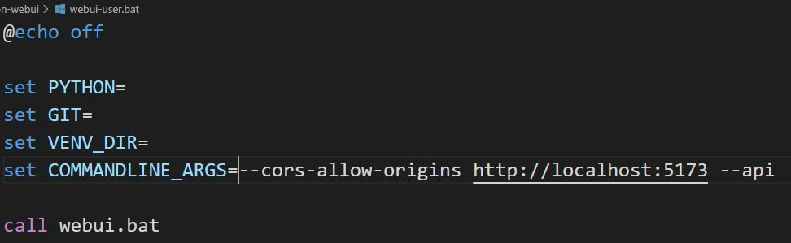
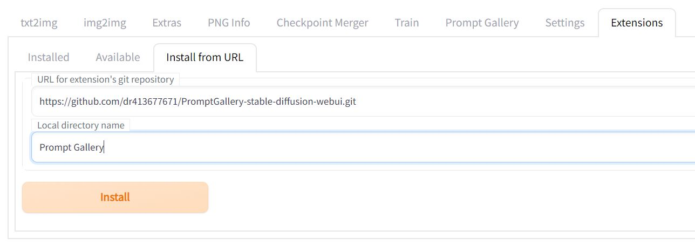
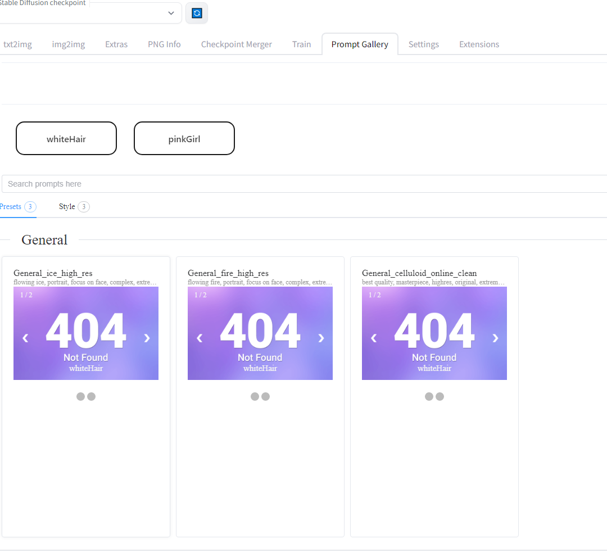

<a name="readme-top"></a>

<div align="center">

<!-- [![Contributors][contributors-shield]][contributors-url] -->
[![Forks][forks-shield]][forks-url]
[![Stargazers][stars-shield]][stars-url]
[![Issues][issues-shield]][issues-url]

</div>
<!-- [![MIT License][license-shield]][license-url]
[![LinkedIn][linkedin-shield]][linkedin-url] -->


<!-- PROJECT LOGO -->
<br />
<div align="center">
  <a href="https://github.com/dr413677671/PromptGallery-stable-diffusion-webui">
    
  </a>

  <h3 align="center">Prompt Gallery</h3>
  <p align="center">
    A prompt cookbook worked as <a href="https://github.com/AUTOMATIC1111/stable-diffusion-webui">stable-diffusion-webui</a> extenstions.
    <br />
    <a href="https://www.youtube.com/watch?v=9U6-moIJUkk"><strong>Watch Demo »</strong></a>
    <br />
    <br />
    <a href="https://github.com/dr413677671/PromptGallery-stable-diffusion-webui/README.md">Explore the docs</a>
    ·
    <a href="https://github.com/dr413677671/PromptGallery-stable-diffusion-webui/issues">Report Bug</a>
    ·
    <a href="https://github.com/dr413677671/PromptGallery-stable-diffusion-webui/issues">Request Feature</a>
  </p>
</div>


<!-- TABLE OF CONTENTS -->
<details>
  <summary>Table of Contents</summary>
  <ol>
    <li>
      <a href="#about-the-project">About The Project</a>
      <ul>
        <li><a href="#built-with">Built With</a></li>
      </ul>
    </li>
    <li>
      <a href="#getting-started">Getting Started</a>
      <ul>
        <li><a href="#Prerequisites-&-Installation">Prerequisites&Installation</a></li>
      </ul>
    </li>
    <li>
      <a href="#usage">Usage</a>
      <ul>
        <li><a href="#build-library">Build Library</a></li>
        <li><a href="#start-stable-diffusion-webui">Start stable-diffusion-webui</a></li>
        <li><a href="#build-library">Build Library</a></li>
        <li><a href="#start-prompt-gallery">Start Prompt Gallery</a></li>
        <li><a href="#populate-previews-and-qc">Populate previews </a></li>
        <li><a href="#populate-previews-and-qc">Quality Contorl</a></li>
      </ul>
    </li>
    <li><a href="#contributing">Contributing</a></li>
    <li><a href="#contact">Contact</a></li>
    <li><a href="#acknowledgments">Acknowledgments</a></li>
  </ol>
</details>


<!-- ABOUT THE PROJECT -->

<div align=center>

</div>

## About The Project

TLDR; Stable-diffusion is an AI model which can generate illustration based on text-based prompts. What does a prompt/prompt-set in AI's eyes? How do we do prompt combination like shopping? 

This is an extension of [stable-diffusion-webui](https://github.com/AUTOMATIC1111/stable-diffusion-webui). Checkout this powerful tool.

Use Prompt Gallery like a cookbook. Build your own prompt-set library and do illustration/creation. Life is that easy.

> Please star the repo if you likes it :>

## Cool Features:
* Scalable Prompt Library
* Stable-Diffusion-WebUI Integration
* Avatar System (model/character presets)

Keep your pace. Let's start from building your prompt library. <a href="#build-library">Build Library</a>

<p align="right">(<a href="#readme-top">back to top</a>)</p>


### Built With

* [![Vue][Vue.js]][Vue-url]
* [![JavaScript][JSP]][JSP-url]
* Gradio
* [![Pytorch][Pytorch]][Pytorch-url]
* [![React][fastapi-img]][fastapi-url]

<p align="right">(<a href="#readme-top">back to top</a>)</p>

<!-- GETTING STARTED -->
## Getting Started

 > 🐘 Good news: we now adapt to webui dark theme.

### Prerequisites & Installation
 
Make sure you cloned the [stable-diffusion-webui](https://github.com/AUTOMATIC1111/stable-diffusion-webui) before. If not check out [stable-diffusion-webui](https://github.com/AUTOMATIC1111/stable-diffusion-webui) to install it first.

**Make sure you add "--api --cors-allow-origins http://localhost:5173" as "COMMANDLINE_ARGS" in webui-user.bat (where you start webui) like this:** 




Follow instructions on [stable-diffusion-webui](https://github.com/AUTOMATIC1111/stable-diffusion-webui) to start webui

Goto Tab extensions in the webui and paste:

1. paste https://github.com/dr413677671/PromptGallery-stable-diffusion-webui.git into textbox "URL for extension's git repository"

2. Set Prompt Gallery as "Local directory name"

 


<p align="right">(<a href="#readme-top">back to top</a>)</p>


## Usage

After installation, try restart webui. You should see a initial frontpage like this.

 

There is no preview pictures. Prompt Gallery works like a framework. You need to generate your own prompt-set library.

Please follow the instructions below to build your own prompt-set library: instead you could watch the video tutorial:
<a href="https://www.youtube.com/watch?v=9U6-moIJUkk">View Demo</a>

Don't be afraid to build the library. There are some cool repo help you browse the prompts.

E.g. If you love anime, goto github and search "tags" or "prompts".

You will see many cool repos like [sd-danbooru-tags](https://github.com/Vetchems/sd-danbooru-tags) or [DeepDanbooru](https://github.com/KichangKim/DeepDanbooru).

### Build library

Build up the prompt-set library and character library.

| value | negative | param |
| :-----| ----: | :----: |
| Positive prompts | Negative prompts | Other params for webui image generation |

Edit the teamplate at <stable-diffusion-webui-path>/extensions/your-prompt-gallery-extension-name/assets/avatars.yaml, and customize your avatars with prompts.

Teamplate: 
   ```yaml
    whiteHair: 
      value: "1 girl,  blush, White hair, Red eyes, animal ears,  looking at viewer, gothic lolita, dramatic angle, very beautiful, beautiful eyes, "
      negative: ""
    pinkGirl: 
      value: "petite, 1girl, solo, pink hair, very long hair, school uniform, happy,outdoors, flower field, excited"
   ```

See the teamplate at <stable-diffusion-webui-path>/extensions/your-prompt-gallery-extension-name/assets/tags.yaml, and create your own prompt-set library.

Categorized your prompt-set Hierarchyly. For example you can create tags.yaml like this:

   ```yaml
    Figure:
      Hair:
        "ponny-tail":
          value: "ponny-tail"
          negative: "lowres, bad anatomy, bad hands, text, error, missing fingers, extra digit, fewer digits, cropped, worst quality, low quality, "
          value: "short_hair"
          negative: "long_hair，lowres, bad anatomy, bad hands, text, error, missing fingers, extra digit, fewer digits, cropped, worst quality, low quality, "
    Background:
      '':
        simple background:
          value: simple background
        sunburst background:
          value: sunburst background
      Nature:
        Space:
          value: "space background, space,"
        Startrails:
          value: colorful startrails
        Woods:
          value: "Woods background, fantacy background,"
   ```

Or do something like setup the webui parameters in "param":

   ```yaml
    Style:
      General Effect:
        "General_ice_high_res":
          value: "flowing ice, portrait, focus on face, complex, extremely detailed , elegant, CG, (an extremely delicate and beautiful girl), incredibly absurdres, best quality,concept art"
          negative: "lowres, bad anatomy, bad hands, text, error, missing fingers, extra digit, fewer digits, cropped, worst quality, low quality, "
          param: "Steps: 30, Sampler: Euler, CFG scale: 11.5, Seed: 1058629707, Size: 512x768, Variation seed: 1692844643, Variation seed strength: 0.27, Seed resize from: 1088x512"
    Background:
      '':
        simple background:
          value: simple background
        sunburst background:
          value: sunburst background
      Nature:
        Space:
          value: "space background, space,"
        Startrails:
          value: colorful startrails
   ```


### Start Prompt Gallery

  Refresh webui.

  Slect tab "Prompt Gallery" on top navigation bar.

  You should see your prompts in prompt-gallery.

  Select avatar (model for demo) -> Select prompt-sets -> Click "send WebUI"

  

  Checkout the downloaded Images

  

  But just the prompt-set is not enough. Let's generate preview picture for them.

### Populate previews and QC

  For instance having added two new prompt-sets, there will be no preview pictures for them.

  

  Goto tab "txt2img" and Select "Prompt Gallery" in tab "scripts"

  

  Upload yaml library of avatar first and select avatar.

  

  Add default prompts or default negative (prompt or negative prompt attach to each prompt-set), and upload prompt-set yaml library.

  If you dont want to skip the prompt-set whose preview is already generated -> Uncheck "skip exists".

  

  Wait for stable-diffusion-webui generate previews automatically.

  

  Pick the best image for preview.

  

  Reflesh. Check it out in Prompt Gallery.

  

  You could always inspect you pictures manually in prompt-gallery-directory/assets/preview/

<p align="right">(<a href="#readme-top">back to top</a>)</p>


### Cutomize default image generation parameters

Edit webui-directory/extension/prompt-gallery-extension-name/paste_this_to_webui_scripts_folder/prompt_gallery.py

You should see the customize setup at the top:

```python
BATCH_SIZE = 4
N_ITER = 2
STEPS = 30
CFG_SCALE = 11.5
WIDTH = 512
HEIGHT = 768
SAMPLER_INDEX = 1
RESTORE_FACE = 'true'
TILING = 'false'
DO_NOT_SAVE_GRID = 'false'
```

Change the params if you need.

<!-- CONTRIBUTING -->
## Contributing

Contributions are what make the open source community such an amazing place to learn, inspire, and create. Any contributions you make are **greatly appreciated**.


<p align="right">(<a href="#readme-top">back to top</a>)</p>


<!-- CONTACT -->
## Talk with me

* dr413677671 - [@zhihu-Calcifer](https://www.zhihu.com/people/kumonoue) - 413677671@qq.com
* Project Link: [https://github.com/dr413677671/PromptGallery-stable-diffusion-webui](https://github.com/dr413677671/PromptGallery-stable-diffusion-webui)

<p align="right">(<a href="#readme-top">back to top</a>)</p>

<!-- ACKNOWLEDGMENTS -->
## Acknowledgments
* [stable-diffusion-webui](https://github.com/AUTOMATIC1111/stable-diffusion-webui)
* [novelai-tag](https://github.com/blacktunes/novelai-tag)
* [Gradio](https://github.com/gradio-app/gradio)

<p align="right">(<a href="#readme-top">back to top</a>)</p>


<!-- MARKDOWN LINKS & IMAGES -->
<!-- https://www.markdownguide.org/basic-syntax/#reference-style-links -->
[contributors-shield]: https://img.shields.io/github/contributors/dr413677671/PromptGallery-stable-diffusion-webui.svg?style=for-the-badge
[contributors-url]: https://github.com/dr413677671/PromptGallery-stable-diffusion-webui/graphs/contributors
[forks-shield]: https://img.shields.io/github/forks/dr413677671/PromptGallery-stable-diffusion-webui.svg?style=for-the-badge
[forks-url]: https://github.com/dr413677671/PromptGallery-stable-diffusion-webui/network/members
[stars-shield]: https://img.shields.io/github/stars/dr413677671/PromptGallery-stable-diffusion-webui.svg?style=for-the-badge
[stars-url]: https://github.com/dr413677671/PromptGallery-stable-diffusion-webui/stargazers
[issues-shield]: https://img.shields.io/github/issues/dr413677671/PromptGallery-stable-diffusion-webui.svg?style=for-the-badge
[issues-url]: https://github.com/dr413677671/PromptGallery-stable-diffusion-webui/issues

[product-screenshot]: images/screenshot.png
[Vue.js]: https://img.shields.io/badge/Vue.js-35495E?style=for-the-badge&logo=vuedotjs&logoColor=4FC08D
[Vue-url]: https://vuejs.org/
[JSP]: https://img.shields.io/badge/JavaScript-323330?style=for-the-badge&logo=javascript&logoColor=F7DF1E
[JSP-url]: https://github.com/TheAlgorithms/JavaScript
[python-img]: https://img.shields.io/badge/Python-FFD43B?style=for-the-badge&logo=python&logoColor=blue
[python-url]: https://www.python.org/
[fastapi-img]: https://img.shields.io/badge/fastapi-109989?style=for-the-badge&logo=FASTAPI&logoColor=white
[fastapi-url]: https://fastapi.tiangolo.com/
[Pytorch]: https://img.shields.io/badge/PyTorch-EE4C2C?style=for-the-badge&logo=PyTorch&logoColor=white
[Pytorch-url]: https://github.com/pytorch/pytorch