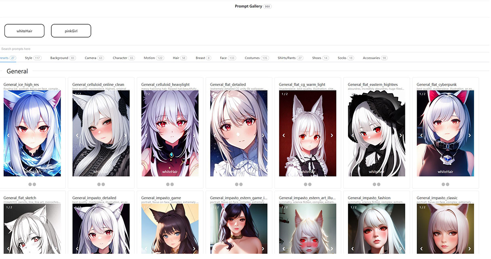
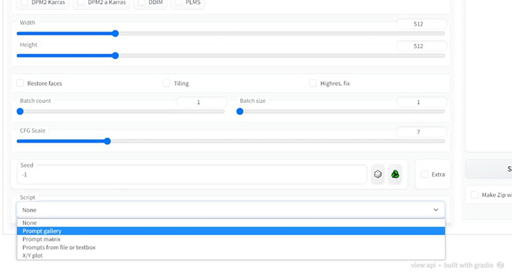
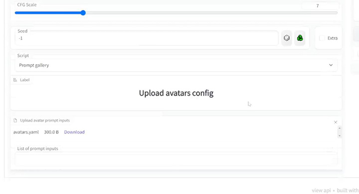
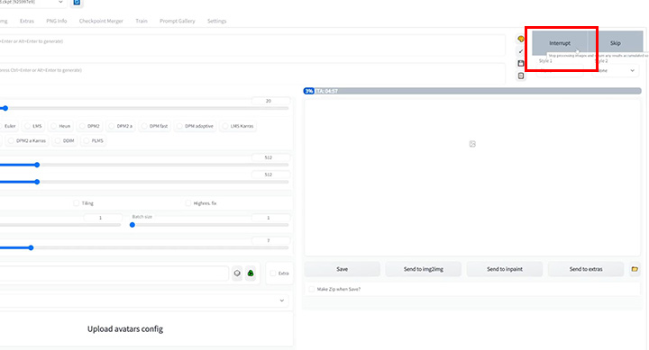
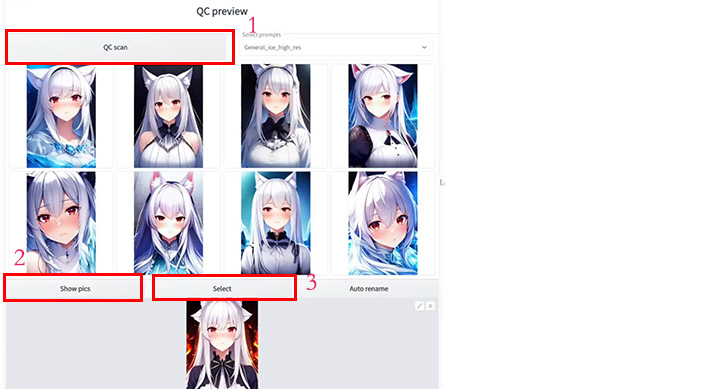
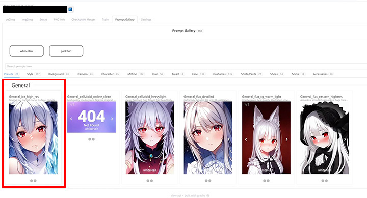

<a name="readme-top"></a>

<div align="center">

[![Contributors][contributors-shield]][contributors-url]
[![Forks][forks-shield]][forks-url]
[![Stargazers][stars-shield]][stars-url]
[![Issues][issues-shield]][issues-url]

</div>
<!-- [![MIT License][license-shield]][license-url]
[![LinkedIn][linkedin-shield]][linkedin-url] -->


<!-- PROJECT LOGO -->
<br />
<div align="center">
  <a href="https://github.com/dr413677671/PromptGallery-stable-diffusion-webui">
    
  </a>

  <h3 align="center">Prompt Gallery</h3>
  <p align="center">
    A prompt cookbook worked as stable-diffusion-webui extenstions.
    <br />
    <a href="https://github.com/dr413677671/PromptGallery-stable-diffusion-webui/README.md"><strong>Explore the docs »</strong></a>
    <br />
    <br />
    <a href="https://www.youtube.com/watch?v=9U6-moIJUkk">View Demo</a>
    ·
    <a href="https://github.com/dr413677671/PromptGallery-stable-diffusion-webui/issues">Report Bug</a>
    ·
    <a href="https://github.com/dr413677671/PromptGallery-stable-diffusion-webui/issues">Request Feature</a>
  </p>
</div>


<!-- TABLE OF CONTENTS -->
<details>
  <summary>Table of Contents</summary>
  <ol>
    <li>
      <a href="#about-the-project">About The Project</a>
      <ul>
        <li><a href="#built-with">Built With</a></li>
      </ul>
    </li>
    <li>
      <a href="#getting-started">Getting Started</a>
      <ul>
        <li><a href="#prerequisites">Prerequisites</a></li>
        <li><a href="#installation">Installation</a></li>
      </ul>
    </li>
    <li><a href="#usage">Usage</a></li>
    <li><a href="#roadmap">Roadmap</a></li>
    <li><a href="#contributing">Contributing</a></li>
    <li><a href="#license">License</a></li>
    <li><a href="#contact">Contact</a></li>
    <li><a href="#acknowledgments">Acknowledgments</a></li>
  </ol>
</details>


<!-- ABOUT THE PROJECT -->

<div align=center>

</div>

## About The Project

TLDR; Stable-diffusion is an AI model which can generate illustration based on text-based prompts. What does a prompt/prompt-set looks like in AI's eyes? Could we do AI illustraion like shopping?

Prompt Gallery works as a guidebook to ease users life in AI art creation. Look at previews and select prompt-set. Life is that easy.

## Cool Features:
* Scalable Prompt Library
* Stable-Diffusion-WebUI Integration
* Avatar System (model/character presets)

Keep your pace. Let's start from building your prompt library.

<p align="right">(<a href="#readme-top">back to top</a>)</p>


### Built With

* [![Python][python-img]][python-url]
* [![React][fastapi-img]][fastapi-url]
* [![Vue][Vue.js]][Vue-url]
* [![JQuery][JQuery.com]][JQuery-url]

<p align="right">(<a href="#readme-top">back to top</a>)</p>


<!-- GETTING STARTED -->
## Getting Started


### Prerequisites

1) Clone Prompt-Gallery extension.
* git
  ```sh
  git clone https://github.com/dr413677671/PromptGallery-stable-diffusion-webui.git
  ```

alternative-1) Download from github release

TBD

alternative-2) Download from docker hub

TBD

### Installation

1. Paste Prompt-Gallery in the root directory of stable-diffusion-webui.
2. Start ./webui-user.sh
3. If you see an error of missing library. Run 
   ```sh
   pip install -r <stable-diffusion-webui-path>/extensions/prompt-gallery/requirements.txt
   ```

<p align="right">(<a href="#readme-top">back to top</a>)</p>


## Usage

View the video tutorial:
<a href="https://www.youtube.com/watch?v=9U6-moIJUkk">View Demo</a>

### Build up the prompt library and character library.

| value | negative | param |
| :-----| ----: | :----: |
| Positive prompts | Negative prompts | Other params of image generation |

Edit the teamplate at <stable-diffusion-webui-path>/extensions/prompt-gallery/assets/avatars.yaml, and customize your avatars.

Teamplate: 
   ```yaml
    whiteHair: 
      value: "1 girl,  blush, White hair, Red eyes, animal ears,  looking at viewer, gothic lolita, dramatic angle, very beautiful, beautiful eyes, "
      negative: ""
    pinkGirl: 
      value: "petite, 1girl, solo, pink hair, very long hair, school uniform, happy,outdoors, flower field, excited"
   ```

Edit the teamplate at <stable-diffusion-webui-path>/extensions/prompt-gallery/assets/tags.yaml, and create your prompt-set categorical library.

Teamplate: 
   ```yaml
    Style:
      General Effect:
        "General_ice_high_res":
          value: "flowing ice, portrait, focus on face, complex, extremely detailed , elegant, CG, (an extremely delicate and beautiful girl), incredibly absurdres, best quality,concept art"
          negative: "lowres, bad anatomy, bad hands, text, error, missing fingers, extra digit, fewer digits, cropped, worst quality, low quality, "
          param: "Steps: 30, Sampler: Euler, CFG scale: 11.5, Seed: 1058629707, Size: 512x768, Variation seed: 1692844643, Variation seed strength: 0.27, Seed resize from: 1088x512"
    Background:
      '':
        simple background:
          value: simple background
        sunburst background:
          value: sunburst background
      Nature:
        Space:
          value: "space background, space,"
        Startrails:
          value: colorful startrails
   ```


### Start stable-diffusion-webui

   ```sh
    ./webui-user.bat
   ```

### Start Prompt Gallery

  Slect tab "Prompt Gallery" on top navigation bar.

  Select avatar (model for demo) -> Select prompt-sets -> Click "send WebUI"

  

  Checkout the downloaded Images

  

### Populate previews

  For instance having added two prompt-sets, and we would like to add preview pictures for them.

  

  Goto tab "txt2img" and Select "Prompt Gallery" in tab "scripts"

  

  Upload yaml library of avatar first and select avatar.

  

  Add default prompts and upload prompt-set yaml library.

  

  Wait for stable-diffusion-webui generate previews automatically.

  

  Pick the best image for preview.

  

  Check it out in Prompt Gallery.

  

<p align="right">(<a href="#readme-top">back to top</a>)</p>

<!-- CONTRIBUTING -->
## Contributing

Contributions are what make the open source community such an amazing place to learn, inspire, and create. Any contributions you make are **greatly appreciated**.


<p align="right">(<a href="#readme-top">back to top</a>)</p>


<!-- CONTACT -->
## Talk with me

* dr413677671 - [@zhihu-Calcifer](https://www.zhihu.com/people/kumonoue) - 413677671@qq.com
* Project Link: [https://github.com/dr413677671/PromptGallery-stable-diffusion-webui](https://github.com/dr413677671/PromptGallery-stable-diffusion-webui)

<p align="right">(<a href="#readme-top">back to top</a>)</p>


<!-- ACKNOWLEDGMENTS -->
## Acknowledgments
* [stable-diffusion-webui](https://github.com/AUTOMATIC1111/stable-diffusion-webui)
* [novelai-tag](https://github.com/blacktunes/novelai-tag)

<p align="right">(<a href="#readme-top">back to top</a>)</p>


<!-- MARKDOWN LINKS & IMAGES -->
<!-- https://www.markdownguide.org/basic-syntax/#reference-style-links -->
[contributors-shield]: https://img.shields.io/github/contributors/dr413677671/PromptGallery-stable-diffusion-webui.svg?style=for-the-badge
[contributors-url]: https://github.com/dr413677671/PromptGallery-stable-diffusion-webui/graphs/contributors
[forks-shield]: https://img.shields.io/github/forks/dr413677671/PromptGallery-stable-diffusion-webui.svg?style=for-the-badge
[forks-url]: https://github.com/dr413677671/PromptGallery-stable-diffusion-webui/network/members
[stars-shield]: https://img.shields.io/github/stars/dr413677671/PromptGallery-stable-diffusion-webui.svg?style=for-the-badge
[stars-url]: https://github.com/dr413677671/PromptGallery-stable-diffusion-webui/stargazers
[issues-shield]: https://img.shields.io/github/issues/dr413677671/PromptGallery-stable-diffusion-webui.svg?style=for-the-badge
[issues-url]: https://github.com/dr413677671/PromptGallery-stable-diffusion-webui/issues

[product-screenshot]: images/screenshot.png
[Vue.js]: https://img.shields.io/badge/Vue.js-35495E?style=for-the-badge&logo=vuedotjs&logoColor=4FC08D
[Vue-url]: https://vuejs.org/
[JQuery.com]: https://img.shields.io/badge/jQuery-0769AD?style=for-the-badge&logo=jquery&logoColor=white
[JQuery-url]: https://jquery.com 
[python-img]: https://img.shields.io/badge/python-v3.9-green
[python-url]: https://www.python.org/
[fastapi-img]: https://img.shields.io/badge/FastAPI-v0.87.0-green
[fastapi-url]: https://fastapi.tiangolo.com/